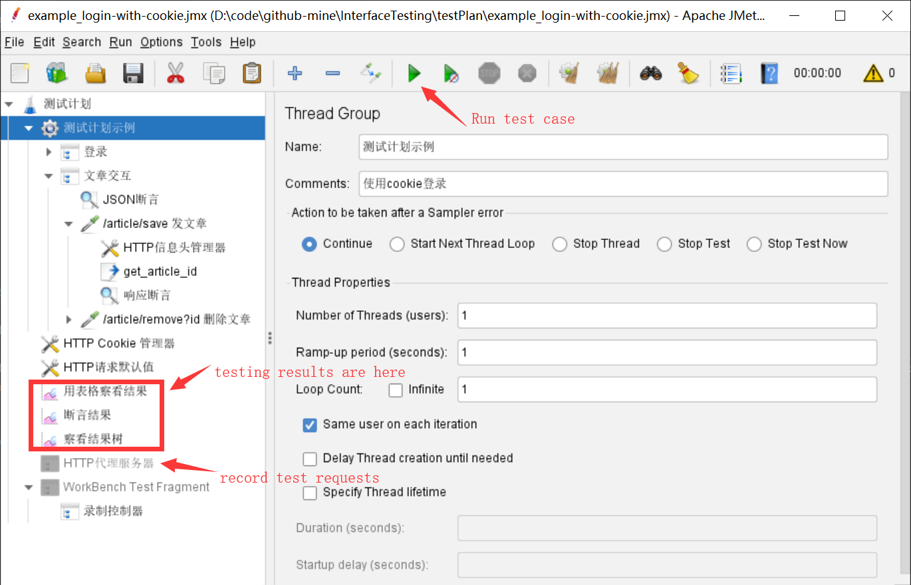
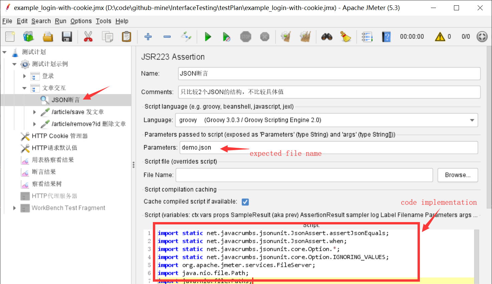

简体中文 | [English](./README.md)

[TOC]

本工程的目的是对HTTP接口进行自动化测试，借助JMeter录制、编辑、组织。使用Ant脚本完成批量脚本执行，以及html格式报告输出。可以和jenkins结合完成自动化接口测试。


# 项目概况
+ 使用JMeter进行http请求录制、用例编写与组织，执行结果检查（断言）
+ 使用Ant运行用例，生成html报告
+ html报告模板基于`${jmeter.home}\extras\jmeter-results-detail-report_21.xsl`改写
+ 用例中的断言除了使用“响应断言”外，还通过groovy脚本实现了JSON Schema断言，由此需要将下面的jar包放在`${jmeterhome}/lib/ext/`下。jar包搜索、下载地址 [https://www.mvnrepository.com](https://www.mvnrepository.com)
    > json-unit-core-\*.jar  
    > json-unit-\*.jar  
    > gson-\*.jar


# 项目目录
```
├── build.xml                             -- ant脚本
├── html-report-template.xsl              -- html报告模板
├── README.md                             -- 
├── resultLog                             -- 
│   ├── html                              -- 
│   │   └── TestReport-201707061055.html  -- html格式的报告
│   └── jtl                               -- 
│       └── TestReport-201707061055.jtl   -- jtl格式的报告（JMeter执行结果）
└── testPlan                              -- 
    ├── expectjson                        -- 
    │   └── ****.json                     -- http返回，预期值json
    ├── ****.jmx                          -- JMeter脚本
    └── ****.jmx
```

# 执行用例



+ JMeter GUI中执行单个jmx用例
+ Ant批量执行所有用例。在项目根目录下，执行命令 `ant -Djmeter.home="/usr/local/apache-jmeter-3.2"`，其中，jmeter.home改成本地JMeter安装路径


# 项目细节介绍

## 项目中的示例
1. `example_login-with-toke.jmx` 演示了以下内容：
    + 参数化变量，用于请求、断言
    + 从http的响应中提取所需值，存于变量
    + 两个http间传递参数
    + 响应断言的写法
    + json断言，含如何断言某个http响应（在http请求的“注释”中编写形如`expectjson={demo.json}`）、断言脚本的写法（使用groovy）
    + http代理录制器的配置

2. `example_login-with-toke.jmx` 演示以下内容：
    + 从登录api的Response中提取token信息
    + 后续api的Http头信息中使用该token信息


## JSON Schema断言

使用了[JsonUnit](https://github.com/lukas-krecan/JsonUnit)，使用方法不再赘述。


## 其他，待补充

# 广告

各位路过的朋友，走过路过不要错过啊~~ 这是本人录制的 **《Web UI自动化测试：Selenium入门》视频课程** ，并放在网上“[网易云课堂](http://study.163.com/course/introduction/1004926010.htm)”。欢迎需要的朋友查看。如果你觉得课程还不错，或者当前的项目对你有帮助，烦请顺手点个赞/收藏，或者介绍给其他需要的朋友。[谢过]

另有《Web UI自动化测试：Selenium进阶》课程正在筹备中，敬请期待...

以后有精力也有可能准备其他的课程，如接口测试、单元测试、持续集成。
